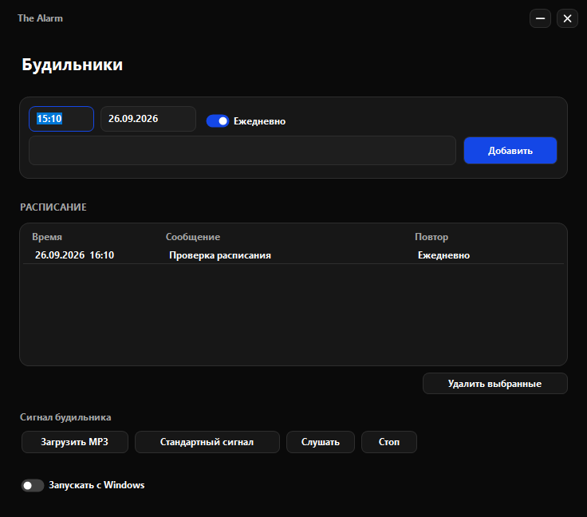
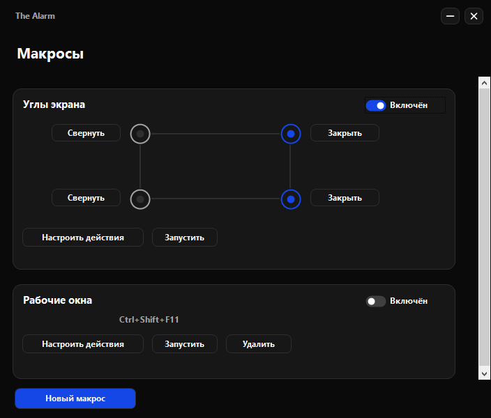
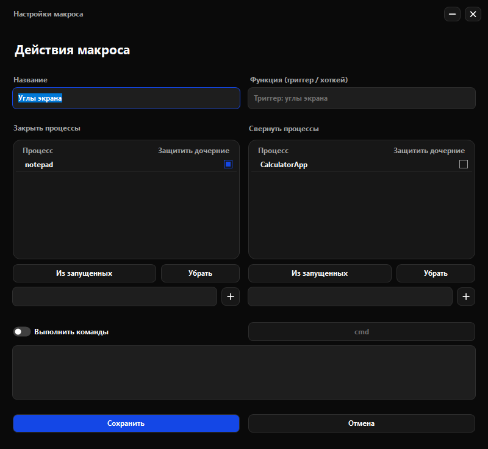

# TheAlarm

TheAlarm — будильник и фоновая утилита для управления приложениями Windows. Настраивайте действия для углов экрана и глобальных горячих клавиш: сворачивайте окна, завершайте процессы и запускайте необязательные команды cmd или PowerShell. Редактор макросов скрыт за сочетанием клавиш, а само приложение работает в системном трее.

## Скачать портативную версию 1.3.0

- **[Скачать Portable — Windows 64-bit / x64 (ZIP)](https://github.com/SputnikUpitera/theAlarm/releases/download/v1.3.0/TheAlarm-win-x64.zip)** — портативная 64-битная версия, для большинства современных компьютеров.
- **[Скачать Portable — Windows 32-bit / x86 (ZIP)](https://github.com/SputnikUpitera/theAlarm/releases/download/v1.3.0/TheAlarm-win-x86.zip)** — портативная 32-битная версия. Обозначение x86 означает 32 бита, а не 64.
- [Все релизы и история версий](https://github.com/SputnikUpitera/theAlarm/releases)

**Оба архива — Portable / self-contained:** без установщика и без необходимости устанавливать .NET. В каждом архиве один `TheAlarm.exe` со встроенными компонентами среды выполнения. Распакуйте архив в папку с правом записи и запустите `TheAlarm.exe`. Не запускайте приложение прямо из ZIP.

При работе рядом с EXE создаётся зашифрованный `config.dat`. Portable означает запуск без установки; шифрование настроек при этом привязано к пользователю Windows (подробнее ниже).

## Требования

Windows 10 или новее. Разрядность Windows можно посмотреть в «Параметры → Система → О системе». Сборка x86 опубликована, но запуск на отдельной 32-битной ОС пока не проверялся.

## Инструкция

Скриншоты показывают интерфейс 1.3.0 с демонстрационными данными.

### 1. Откройте будильник

При запуске приложение находится в трее. Левый клик по значку открывает будильник; правый показывает меню «Открыть будильник» и «Выйти».

Введите время в формате `ЧЧ:ММ`, дату `ДД.ММ.ГГГГ` и, при необходимости, сообщение. Включите «Ежедневно» для повторения: в этом режиме используется ближайшее наступление указанного времени, а не введённая дата. Нажмите «Добавить».



В разделе «Сигнал будильника» можно загрузить свой MP3, прослушать его или вернуть стандартный сигнал. Выбранный MP3 остаётся внешним файлом: не перемещайте и не удаляйте его. Переключатель «Запускать с Windows» включает автозапуск.

При срабатывании появляется уведомление со звуком. Одноразовый будильник удаляется, ежедневный переносится на следующее срабатывание.

### 2. Откройте макросы

Из открытого окна будильника нажмите **Ctrl+Alt+F1**. Будильник сменится окном макросов. Повторное нажатие вернёт будильник.

**Это внутреннее сочетание не работает, когда приложение полностью скрыто в трее.** Пользовательские хоткеи активных макросов, напротив, работают в фоне. Ctrl+Alt+F2 не используется.



Макрос «Углы экрана» существует по умолчанию. Включите нужные углы круглыми переключателями и отдельно выберите для каждого действие: «Закрыть» или «Свернуть». Общий переключатель «Включён» управляет активностью макроса.

Кнопка «Новый макрос» создаёт макрос с горячей клавишей. «Настроить действия» открывает его редактор, «Запустить» выполняет действия вручную.

### 3. Настройте действия

Задайте название и нажмите нужное сочетание в поле хоткея. У углового макроса триггер фиксированный: углы экрана.



Списки «Закрыть процессы» и «Свернуть процессы» независимы. Добавьте имя процесса вручную или выберите его кнопкой «Из запущенных». «Убрать» удаляет выделенные строки из списка.

Справа находится «Защитить дочерние»: при включении дочерние процессы исключаются из соответствующего действия. Один клик по квадрату меняет настройку; один клик по строке только выделяет её, двойной меняет настройку. Для выделенных строк также работает пробел.

Перед завершением целевые окна принудительно сворачиваются. Если завершение не удалось, оставшееся окно можно восстановить с панели задач.

**Завершение процессов принудительное: несохранённые данные могут быть потеряны.** Сначала проверяйте макрос на ненужных тестовых окнах.

### 4. При необходимости добавьте команды

Включите «Выполнить команды», выберите `cmd` или `PowerShell` и впишите команды прямо в редактор. Внешние BAT/PS1-файлы для этого не нужны. Нажмите «Сохранить».

Оболочка запускается скрыто с запросом повышения прав; окно UAC может потребовать подтверждения. Действия над процессами используют права самого TheAlarm: для управления повышенными приложениями могут понадобиться права администратора.

Одинаковое сочетание нельзя назначить двум пользовательским макросам. Сочетания, занятые Windows или другой программой, могут не зарегистрироваться; поддержка абсолютно всех системных комбинаций не гарантируется. В редакторе пользовательские горячие клавиши временно приостанавливаются.

### 5. Сверните или завершите приложение

Крестик главного окна скрывает приложение в трей; будильники и активные макросы продолжают работать. В модальном редакторе крестик закрывает редактор без сохранения изменений. Для полного выхода используйте **«Выйти» в меню трея**.

## Хранение и ограничения

Настройки и тексты макросов хранятся рядом с EXE в общем зашифрованном `config.dat`. В релизные архивы пользовательские настройки не включаются.

Шифрование использует Windows DPAPI для текущего пользователя: файл нельзя прочитать как обычный текст, но это не защита от программ, работающих с правами той же учётной записи. Перенос файла на другой компьютер или к другому пользователю не гарантирует расшифровку.

Полная совместимость произвольных BAT-сценариев не гарантируется: cmd-команды передаются через стандартный ввод. Длинные PowerShell-команды ограничены длиной командной строки Windows. Pomodoro пока не реализован.

## Сборка из исходников

Нужны Windows и .NET SDK 8.

Обычная сборка, требующая установленного **.NET Desktop Runtime 8**:

```powershell
dotnet build -c Release
```

Результат: `bin/Release/net8.0-windows/TheAlarm.exe`.

Автономная сборка:

```powershell
dotnet publish TheAlarm.csproj -c Release -r win-x64 --self-contained true -p:PublishSingleFile=true -p:IncludeNativeLibrariesForSelfExtract=true -p:EnableCompressionInSingleFile=true -o artifacts/release/win-x64
```

Для 32-битного варианта замените оба вхождения `win-x64` на `win-x86`. Workflow GitHub Actions собирает обе архитектуры при публикации тега `v*`.

Проверки:

```powershell
dotnet run --project tests/Smoke/Smoke.csproj -p:PublishSingleFile=false
```

Технический контекст: [CONTEXT.md](CONTEXT.md). План: [IMPLEMENTATION_PLAN.md](IMPLEMENTATION_PLAN.md). Ограничения и анализ стабильности: [STABILITY_AUDIT.md](STABILITY_AUDIT.md).

## English Quick Start

Download **[Portable 64-bit / x64 (ZIP)](https://github.com/SputnikUpitera/theAlarm/releases/download/v1.3.0/TheAlarm-win-x64.zip)** or **[Portable 32-bit / x86 (ZIP)](https://github.com/SputnikUpitera/theAlarm/releases/download/v1.3.0/TheAlarm-win-x86.zip)**, extract it to a writable folder and run `TheAlarm.exe`. Both builds are self-contained: no installer or separate .NET installation is required.

- Left-click the tray icon to open alarms. Right-click and choose «Выйти» to exit.
- Press **Ctrl+Alt+F1** while the alarm or macro window is visible to switch between them. This internal shortcut is disabled in tray-only mode; user macro hotkeys remain active.
- Configure each screen corner independently, or create a hotkey macro. Add processes manually or select running ones.
- The right-hand checkbox protects child processes. Click it once, or double-click the row, to toggle.
- Optional cmd/PowerShell commands are edited in the app and run through a hidden elevated shell; UAC confirmation may appear.
- Forced process termination can lose unsaved work. Encrypted settings use current-user Windows DPAPI and are not guaranteed to be portable across accounts or computers.


